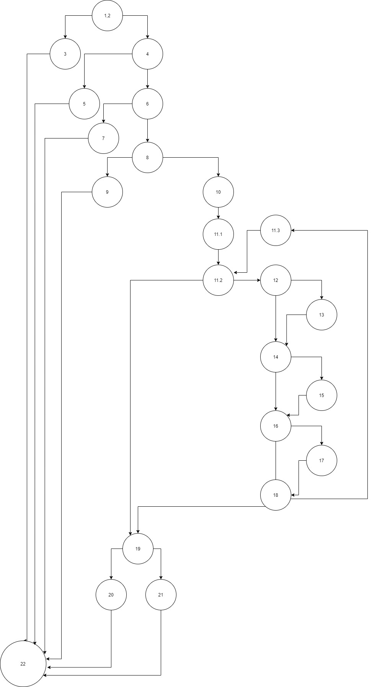

#Втора лабораториска вежба по Софтверско инженерство
## Јован Ташков, бр. индекс 186092
###Група на код:
Ја добив групата на код 3
###Control Flow Graph

###Цикломатска комплексност
Цикломатската комплексност на овој код е 11, истата ја добив преку бројот на региони. Во случајoв бројот на региони е 11, па цикломатската комплексност изнесува 11.
###Тест случаи според критериумот Every statement
1,2 ; 3 ; 4 ; 5 ; 6 ; 7 ; 8 ; 9 ; 10  
(11) 11.1, 11.2, 11.3 ; 12 ; 13 ; 14 ; 15  
16 ; 17 ; 18 ; 19 ; 20 ; 21 ; 22
###Тест случаи според критериумот Every path
//1,2, 3, 22  
//1,2, 4, 5, 22  
//1,2, 4, 6, 7, 22  
//1,2, 4, 6, 8, 9, 22  
//1,2, 4, 6, 8, 10, 11.1, 11.2, 19, 20, 22 - ne e mozno  
//1,2, 4, 6, 8, 10, 11.1, 11.2, 19, 21, 22 - ne e mozno  
//1,2, 4, 6, 8, 10, 11.1, (site 7 slucai kade sto passwordot ima dolzina pogolema od 8 no nema da gi ispolni uslovite za validen password), 19, 20, 22   
//1,2, 4, 6, 8, 10, 11.1, (11.2, 12, 13, 14, 15, 16, 17, 18, 11.3), 19, 21, 22
### Објаснување на напишаните unit tests
За Every path тестот проверувам дали враќа исклучок функцијата со assertThrows
и со assertTrue проверувам дали е пораката на исклучокот кој што го очекувам.
Во сите случаи каде што функцијата ќе врати boolean вредност со assertFalse проверувам дали враќа 
false во случаите каде што очекувам да врати, а со assertTrue проверувам дали враќа True во
случаите каде што очекувам да врати True. 

За Multiple conditions тестот ги проверувам сите можни случаи каде што очекувам исклучок, функцијата да врати False и функцијата да врати True.